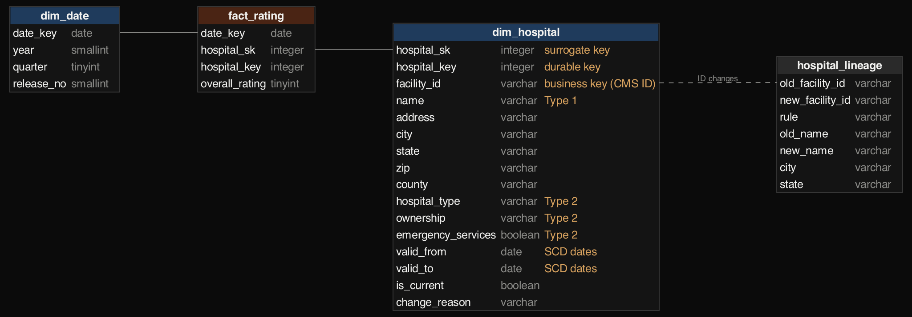

# Hospital data warehouse: seven years of CMS releases with full history (Type 2 SCD)

CMS publishes a new snapshot of every US hospital's basic facts and overall star rating each quarter. Each snapshot
overwrites the last, so the history is lost. This project rebuilds that history: a Kimball star schema in DuckDB,
loaded release by release from 33 CMS snapshots (March 2019 – August 2026), the way a scheduled ETL job would.
It answers what a flat file can't:
- which hospitals changed ownership, and when;
- which ones converted into a new kind of hospital;
- what the ratings looked like as things were at the time.

Build log: https://mrrishit909.github.io/projects/hospital-warehouse/

## Data

CMS Provider Data Catalog, *Hospital General Information* (dataset `xubh-q36u`). Each quarterly snapshot comes from the
hospitals data archive, which the catalog's archive API lists. The September 2026 item is a partial update without this
dataset, so 33 of 34 snapshots are used. CMS renamed several columns over the years ("Provider ID" became "Facility
ID", "Hospital Name" became "Facility Name"); `download.py` maps them to one set of names. Not committed.

## Steps

| Step | File | What it does |
|---|---|---|
| 1 | `download.py` | 34 archive zips → one General Information CSV per release |
| 2 | `sql/01_model.sql` … `04_load.sql`, `warehouse.py` | star schema; lineage of facility-ID changes; staged, idempotent release-by-release load with an ETL audit |
| 3 | `sql/05_marts.sql` | the questions below |
| 4 | `check.py`, `charts.py` | idempotency, SCD integrity and a replay against the raw files; charts |

## The model



- **`fact_rating`**: a periodic snapshot with one row per hospital per release (175,908 rows) and the overall star
  rating (NULL when CMS says "Not Available").
- **`dim_hospital`**, a slowly changing dimension:
  - **Type 2** (a new dated row) for ownership, hospital type and emergency services: these change for real reasons.
  - **Type 1** (overwritten) for name and address. I measured first: of 2,081 name changes between releases, many are
    cosmetic ("ST VINCENT'S EAST" → "ST. VINCENT'S EAST"), so versioning them would mostly record noise.
- **Durable key (`hospital_key`).** A Rural Emergency Hospital conversion gets a brand-new CMS facility ID, and so does
  an acute hospital becoming a critical access hospital. Keyed on the CMS ID alone, the hospital would look closed and a
  new one opened. `hospital_lineage` links 104 such ID changes (old ID left the data in the same city before the new
  ID appeared; names share at least half their distinctive words, or the new one is a Rural Emergency Hospital with a
  single candidate in its city). Every link is listed in `results/lineage.csv`. 11 links pair unusual types (for
  example two Rural Emergency Hospitals converting back) and deserve a manual check.

The dimension holds 7,260 versions of 5,906 hospitals, 5,419 of them current:
- 859 ownership versions;
- 349 emergency-services versions;
- 104 new-ID versions;
- 42 returns after being absent.

## The ETL

`warehouse.py` loads each release in date order:
1. stage and normalise the file;
2. overwrite Type 1 attributes;
3. close changed versions and open new ones (Type 2);
4. close hospitals that left the data, and reopen returners;
5. add new hospitals, carrying the durable key across ID changes;
6. append the facts.

A release already loaded is skipped, so re-running changes nothing. `etl_audit` records every step's count per release
and shows how the data source itself behaves:
- **Coverage changes look like openings.** 581 "new" hospitals in July 2019 are CMS adding psychiatric hospitals, and
  139 in July 2023 are VA hospitals.
- **Some releases are re-publications with no changes at all** (March 2021, April 2022, October 2023).

## Findings

- **Ownership churn is real but noisy.** Of 859 recorded ownership changes:
  - 378 are relabels within a group (e.g. non-profit "Other" → non-profit "Private");
  - 79 are undone by the very next version, most likely corrections;
  - 431 are genuine moves between non-profit, for-profit and government that stick.
- **Between the first and last releases** (hospitals present in both): 63 non-profits became for-profit and 75 for-profits
  became non-profit. 93 government hospitals became non-profit and 50 non-profits went the other way.
- **A new kind of hospital.** 45 Rural Emergency Hospitals are listed, a designation created in 2023 for rural hospitals
  that stop inpatient care but keep the emergency room. CMS only started listing them in November 2025. Through lineage,
  42 trace back to an earlier hospital: 23 acute-care and 19 critical access hospitals.
- **As-was vs as-is.** The share of rated hospitals with 4–5 stars in March 2019, grouped by ownership *at the time*
  (non-profit 40.8%, for-profit 30.1%, government 30.6%), barely differs from grouping by *today's* ownership (40.5%,
  30.6%, 30.7%). For this question a Type 1 overwrite would mislead by under a point, because few hospitals changed
  group. Questions like "who converted, and when?" are impossible without Type 2.

## Check

`check.py`:
- re-runs the whole job and confirms it adds nothing;
- confirms there's at most one current version per hospital and that versions never overlap;
- confirms every fact points at the version valid on its date, and facts per release equal the hospitals in that raw file;
- replays 500 random (hospital, release) pairs against the raw snapshot files: ownership, type and emergency services as
  of that date all match;
- confirms current names equal the latest file.

## Run it

```
python3 -m venv venv && ./venv/bin/pip install pandas duckdb matplotlib
./venv/bin/python download.py && ./venv/bin/python warehouse.py && ./venv/bin/python check.py && ./venv/bin/python charts.py
# charts.py draws the schema with Graphviz's `dot`
```

## Not done

- Lineage is rule-based. CMS's Provider of Services file records related provider numbers and would confirm each link.
- Star ratings use CMS's methodology of the time, which changed in 2021, so ratings across years are not strictly comparable.
- No other measure facts (readmissions, patient experience); the model has room for them on the same dimensions.
